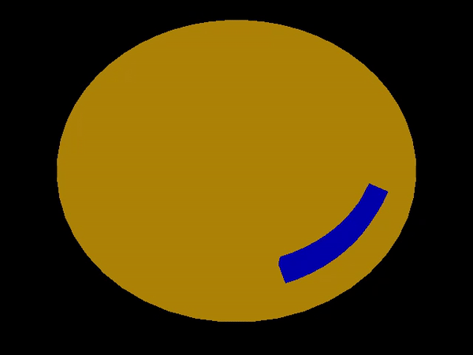
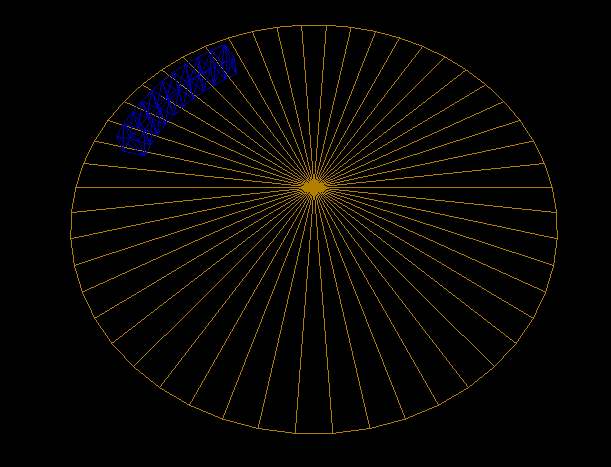

# DEVLOG

Week 1:

    Setup project with cmake

    Added libraries for basic work with openGL: GLFW and GLEW
    
    Added Lodepng library for loading textures
    
    Added 3D Vector and Matrix structs with desired functionality

    Added basic support for loading, compiling and using shaders

Week 2:

    Updated project structure - engine as lib, added separate Game project.

    Added simple renderer - now supporting VBO, IBO and array objects. Also supports custom shader data layout.

    Added entity component system supporting basic components - tranform, name ...

    Added scriptable components - possible to add behaviour to entity as component.

Week 3:

    Added rendering system - automatically render all entities with mesh and shader components.

    Added some math classes - quaternion, mat4, vec4.

    Added camera.

    Added uniform buffer support.

    Added keyboard input support.

Week 4:

    Added generation of ark and circle mesh with parameters.

    Added behaviour of player arch (moving around the platform)

    Added conversions between cartesian and polar/cylindrical coords.

    Added bounding box component and its visualization (so far only manual setting)
    
    

    
    

